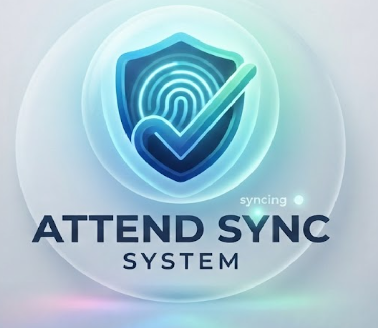

<div align="center">
  
  <h2>Attend Sync System — Frontend Client Application</h2>
</div>

> **Note:** For the full project overview, live demo links, architecture, and backend setup, please check the main [Root README.md](../README.md).

---

## 🚀 Live Demo & Web App Links

- **Web App (Live Demo):** `https://attendsync-demo.vercel.app` *(Replace with your deployed frontend URL)*
- **API Endpoint:** `http://localhost:5000/api` (Local) / `https://attendsync-api.onrender.com` (Production)

---

## ⚡ Quick Start

1. **Install Dependencies:**
   ```bash
   npm install
   ```

2. **Setup Environment Variables:**
   Create `.env.local`:
   ```env
   NEXT_PUBLIC_API_URL=http://localhost:5000/api
   ```

3. **Run Dev Server:**
   ```bash
   npm run dev
   ```

Open [http://localhost:3000](http://localhost:3000) with your browser to see the frontend application.

---

## 🛠️ Features & Pages

- 📊 `/dashboard` - Overview & analytics stats
- 🧮 `/calculator` - Smart Bunk & Recovery Planner
- 📅 `/timetable` - Weekly Class Schedule
- 📈 `/analytics` - Detailed charts powered by Recharts
- 📋 `/reports` - Logs & Exportable reports
- 🔐 `/login` & `/register` - Auth flows with JWT
